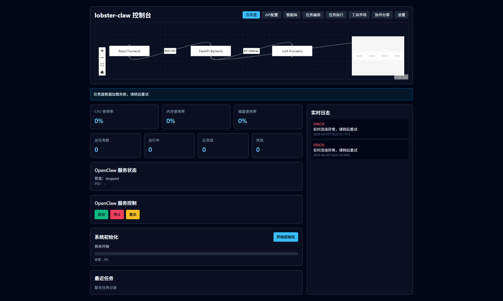
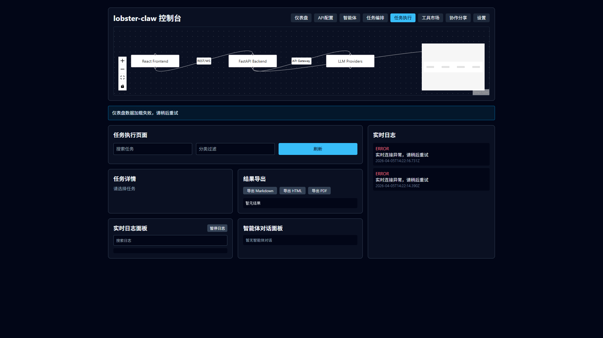
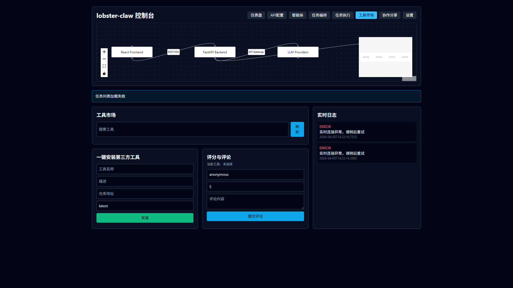

# 🚀 [你的项目名] - [一句话定位]

> [一句话卖点：例如「5分钟搭建可视化 AI 工作流平台，开箱即用，支持企业级扩展」]

[](https://github.com/[GITHUB_OWNER]/[GITHUB_REPO]/stargazers)
[](https://github.com/[GITHUB_OWNER]/[GITHUB_REPO]/issues)
[](./LICENSE)
[](https://github.com/[GITHUB_OWNER]/[GITHUB_REPO]/releases)
[](https://github.com/[GITHUB_OWNER]/[GITHUB_REPO]/releases)

---

## ✨ 项目定位

**[你的项目名]** 是一个 **[项目类型]**，帮助你快速解决 **[解决的问题]**。  
不需要复杂配置，不需要深入底层，目标就是：**让新手也能在几分钟内跑起来，老手也能二次开发到生产级。**

### 🔥 核心功能

- [核心功能1]
- [核心功能2]
- [核心功能3]
- [核心功能4]
- [核心功能5]

### 🧱 技术栈

- 后端：[技术栈-后端，如 Python 3.11 / FastAPI / SQLAlchemy]
- 前端：[技术栈-前端，如 React 18 / TypeScript / React Flow]
- 基础设施：[技术栈-部署，如 Docker / Docker Compose]

### 🚢 部署方式

- [部署方式1：一键脚本]
- [部署方式2：Docker Compose]
- [部署方式3：手动安装]

---

## 🖼️ 视觉展示（先看效果再看代码）

> 图片命名规范：
> - `assets/screenshots/screenshot-1-main.png`
> - `assets/screenshots/screenshot-2-core.png`
> - `assets/screenshots/compare-old-vs-new.png`
> - `assets/screenshots/demo-install-to-result.gif`

### 1) 全景图（全局认知）


### 2) 核心功能特写（关键动作）


### 3) 效果对比图（价值证明）


---

## 💡 为什么用户会喜欢它（用户视角）

1. **上手快**：跟着文档 5 分钟即可跑通，不会卡在环境配置。
2. **看得懂**：可视化操作比写一堆配置文件更直观，降低学习门槛。
3. **能扩展**：支持插件、模板、二次开发，业务越复杂越体现价值。
4. **可协作**：支持分享、模板复用、多角色协作，团队效率明显提升。
5. **够稳定**：有日志、错误兜底、执行状态可视化，定位问题不靠猜。

---

## ⚡ 快速上手（新手友好）

### 方式 A：一键脚本（推荐）

```bash
# [请替换为你的一键安装命令]
curl -fsSL [INSTALL_SCRIPT_URL] | bash
```

### 方式 B：Docker Compose

```bash
git clone https://github.com/[GITHUB_OWNER]/[GITHUB_REPO].git
cd [GITHUB_REPO]
docker compose up --build
```

### 方式 C：手动安装

```bash
# 后端
cd backend
python -m venv .venv
# Windows: .venv\Scripts\activate
# macOS/Linux: source .venv/bin/activate
pip install -r requirements.txt
uvicorn app.main:app --host 0.0.0.0 --port 8000

# 前端（新终端）
cd frontend
npm install
npm run dev
```

### ✅ 验证是否启动成功

- 打开前端：[http://localhost:5173](http://localhost:5173)
- 健康检查：[http://localhost:8000/api/v1/health](http://localhost:8000/api/v1/health)

---

## 📚 完整教程

- 基础配置教程：[`docs/guide-basic.md`](./docs/guide-basic.md)
- 进阶开发教程：[`docs/guide-advanced.md`](./docs/guide-advanced.md)
- 实战案例教程：[`docs/case-media.md`](./docs/case-media.md)
- 视觉素材指南：[`docs/visual-assets-guide.md`](./docs/visual-assets-guide.md)
- 视频教程脚本：[`docs/QUICKSTART_VIDEO_SCRIPT.md`](./docs/QUICKSTART_VIDEO_SCRIPT.md)

> 文档总入口（占位符）：[DOCS_HOME_URL]

---

## 🧩 贡献指南

欢迎任何形式的贡献：

- 提交 Bug：[`Issues`](https://github.com/[GITHUB_OWNER]/[GITHUB_REPO]/issues)
- 提交功能建议：[`Discussions`](https://github.com/[GITHUB_OWNER]/[GITHUB_REPO]/discussions)
- 贡献代码：Fork -> Commit -> Pull Request

建议先阅读：[`CONTRIBUTING.md`](./CONTRIBUTING.md)（如尚未创建，请补充）

---

## 📌 用户案例（占位符）

- [用户案例1：公司/团队名称 + 成果]
- [用户案例2：个人开发者 + 成果]
- [用户案例3：教育/研究场景 + 成果]

> 想展示你的案例？欢迎提交 PR 到 `docs/cases/`。

---

## 🪪 许可证

本项目基于 **MIT License** 开源，详见 [`LICENSE`](./LICENSE)。

---

## 🌟 如果这个项目帮到了你

请给一个 **Star** 支持一下，这会让项目被更多人看到，也会推动后续迭代更快进行。  
👉 [点我 Star](https://github.com/[GITHUB_OWNER]/[GITHUB_REPO]/stargazers)
